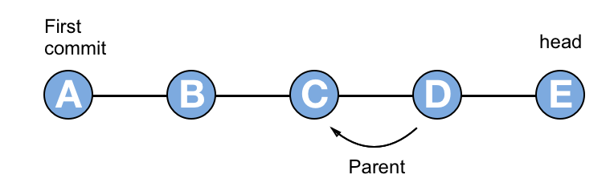
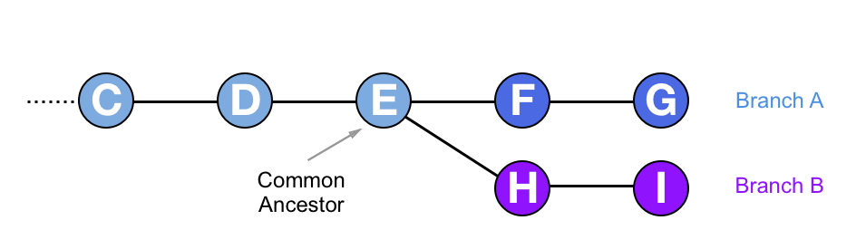
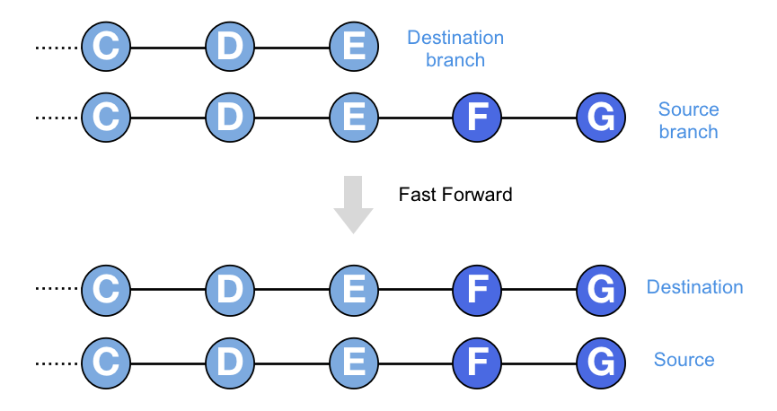
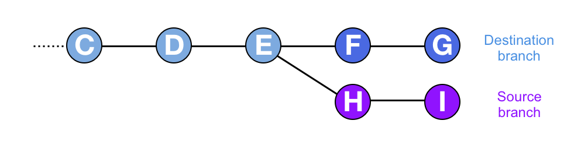
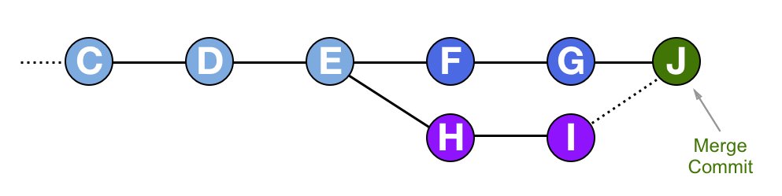

At [Ocasta](https://ocasta.com) we have a diverse group of developers working with a variety of languages and technologies. Each of us works day-to-day with some combination of Swift, Go, JavaScript, Java, Kotlin, Ruby, HTML, or CSS, to name a few. But the one thing we have in common is that every day we find ourselves using [Git](https://git-scm.com/).

All of our projects use Git for code storage and to help collaboration. We use Bitbucket as a hosted service, partly because of its tight integration with Jira for task management, and our workflow involves code reviews on pull requests based on Git branches. As with any tool that you use every day, some of us understand it just enough to get by, while others (such as [David](https://dcrichards.com/) and myself) are Git Geeks.

Many people find Git obscure and scary, learning just enough terminal commands, or set of clicks through a GUI interface to be able to collaborate on a project. In order to rectify this, David and I recently prepared an internal Ocasta skill-share going through the basics of Git theory and giving a demo of it’s use in the wild. We both thought we understood Git rather well, but the research we did to prepare for the skill-share uncovered some shocks and surprises. One of these is so fundamental to how Git works I felt it would be worth sharing in a blog post.

## How I thought Git merges worked
A typical part of a Git workflow involves merging branches. Branches allow different features of a system to be developed in parallel, often by different developers working on the same codebase.

At Ocasta we mostly tie Git branches to Jira tickets. So as an example, I might be working on a branch called `myproject-123-useful-feature` where 123 is the ticket number on `myproject` that details a useful feature the client wants.

While I am working on the feature, someone has fixed a nasty bug (say on branch `myproject-456-nasty-bug`) and merged it into the develop branch, which we use to represent the latest working state of development. At this point I want to include the bug fix in the work I am doing, so I will perform a git merge to merge develop into my branch.

After I have merged the branch, I will now have all the latest commits from develop (and from `myproject-456-nasty-bug`) on my branch. In fact, I can see them. If I run git log on my repository, I can see the commits in the history of my branch.

At least that’s what I **thought**. I have since discovered that it’s not true. The commits from the develop branch are not on my branch. I didn’t really **get** Git.

## What is a branch then?

All Git commits have a parent, except for the very first commit. The commit that you are checked out onto has a parent, which in turn has a parent, and so on, with the full chain of commits making your commit history. All a branch is, in reality, is a label that points to the latest commit in a chain. The commit pointed to by a branch name is known as the `head` of that branch. If I make a new commit on a branch, the previous head becomes the parent of the new commit, and the new commit becomes the head of the branch.

A branch is a string of commits that go all the way back to the first commit in the repository. If I make a new branch while checked out onto a commit, all the commits up to that point are now on both branches. The new branch and the old branch both point to the same commit and share the same history.

The two branches can now be worked on independently. One developer is checked out onto branch A and adds new commits. Meanwhile, another developer is checked out onto branch B and adds different commits. The new commits added to each branch will only exist on that branch. The first commit that the two branches share in their history is called their `common ancestor`.

## Fast forward merges – when one branch is behind

Merging is actually a bad name for what `git merge` does because when you merge two things you expect to end up with one thing. It’s better to think of `git merge` as *importing* commits from one branch to another.

When I do a `git merge` on branch A, to import the commits from branch B, branch A changes but branch B remains unchanged. In this article, I will keep referring to the process as merging, as that’s the terminology that Git uses. However, it’s important to remember that after merging one branch into another, both branches are still there.

Merging branches can work one of two ways, either with a *Fast forward* or a *Merge commit*. Fast forwarding is the simplest case and is also the most common case. It is the basis for pushing and pulling commits to a repository.

Let’s imagine I want to merge a source branch into a destination branch, and the source branch has all the commits from the destination branch in it, plus some extra ones on top. The destination branch could be thought of as being *behind* the source branch, in that the source branch has moved on and has extra commits. In this case git `merge will` simply move the head of the destination branch to point to the head of the source branch. This is called a fast-forward because you are essentially moving the destination branch forward in time to line up with the source branch.

This is the case you meet most of the time, especially when dealing with a remote repository like Bitbucket or Github. I will be working on a branch and at the end of the day will `push` my commits up to the remote repository. When I do this, the remote repository’s version of my branch will be fast forwarded to include the commits from my local branch. The same is true in the other direction when I do a `git pull` to get the latest changes on a branch. A `git pull` will first do a `git fetch`, to retrieve the remote changes, and then will do a `git merge` to fast-forward my local branch and update it with the new commits.

## Merge commits – when branches have diverged

Fast forwarding only works if the destination branch (the one you want to merge into) doesn’t have any differences with respect to the source branch (the one you want to merge from). If the destination branch has extra commits on it that aren’t on the source branch, then the two branches are said to have *diverged* and a different merge strategy is needed.

I had always assumed that Git would add the commits from the source branch onto the destination branch in some fashion, as they appear to end up on the destination branch. What Git actually does is more subtle and pretty clever.

When branches have diverged, and you merge a source branch *into* a destination branch, a *merge commit* is created on the destination branch. A merge commit is just like a normal commit, with the exception that it has two parents instead of one.

First Git will gather together all the changes in the source branch since its common ancestor with the destination branch. In the diagram above these are the changes in commits H and I. Git will put all those changes together, and then add them into a single commit and apply it to the destination branch. This single commit is the merge commit, and it has two parents. The main parent is the previous head of the destination branch, as in a normal commit. The second parent is the head of the source branch.

By doing this Git can apply all the changes necessary for the merge to the destination branch, and keep a reference to the commits that they came from, without affecting the source branch at all. At the end of the process, the source branch remains exactly as it was, and the destination branch has one extra *merge commit*. If there were changes necessary to resolve a conflict during a merge, Git stores those changes in the merge commit.

However, the commits that you have merged in are not really *on* your branch. The changes from the commits have been applied to your branch in a single commit, and Git has kept a pointer to where they came from, but the original commits sit untouched on the source branch where they were originally created.

## In my defence – why I never knew this

The main reason this came as a shock to me is that Git goes out of its way to hide this from you, at least on the command line. I regularly use the command `git log` to show my commit history. After merging one branch into another, the output of `git log` will include commits from the source branch as well as the destination branch.

It is only clear which commit belongs to which branch when you look at the history using a visual tool, such as Bitbucket, or locally using a GUI client or [tig](https://github.com/jonas/tig). By default `git log` displays all the commits that have been added to or merged into your branch ordered by date. I have looked through the `git log` manual pages and, surprisingly, I haven’t yet found an option that only shows commits on your branch.

It could be that this is just a semantic issue. What after all does *on your branch* mean? If the changes from a commit have been incorporated into the current branch, and if the commit message provides useful contextual information, doesn’t it make sense to show that commit on the history? Isn’t it effectively *on the branch*.

But doing it this way does lead to some weirdness. For example, in Git you can use the syntax `HEAD~2` to refer to the commit that is two commits before the current head. Git interprets this as being the parent of the parent of the current commit on this branch. If you have recently done a merge, and some of the merged in commits were made since the commit you are referencing, `HEAD~2` might actually be many commits back in the `git log` history and not two commits as you expected.

##What have I learned

Git is very clever and very powerful, and for various reasons quite confusing. It is possible to use Git successfully without understanding it at all, but deeper knowledge will lead to greater proficiency even though this knowledge can be quite hard to gain.

I feel I have a better grasp of how Git works after preparing for the skill-share, but at the same time I feel that I have only scratched the surface. Since embarking on this adventure I have acquired a thick paperback book about Git, which is currently sitting on my desk. I intend to get as much information out of it as I can and if I discover anything else that is shocking I will be sure to let you all know. In the meantime, I’d highly recommend trying to get Git.