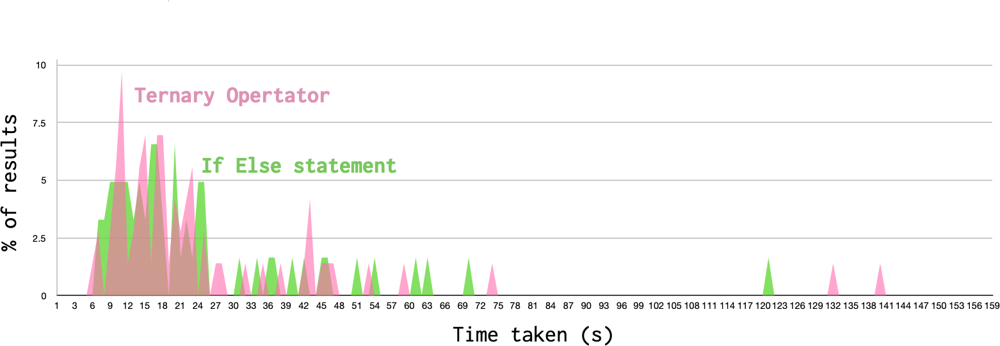

Have you ever had a really cool, simple idea that turned into a completely different, much more complicated reality? In July 2018 I had a nice idea for a conference talk about coding and grammar. A few months later I was designing and running an online scientific experiment!

In my last [post][1], I explained how my interest in linguistics, and specifically the difference between *prescriptive* and *descriptive* grammar, inspired me to try and uncover descriptive rules for how to write readable code. I told the story of how this search led to my experiment on [howreadable.com][2].

The aim of *howreadable* is to discover rules for improving readability that developers instinctively follow when writing code. I haven't found any rules yet, but I have discovered that experiment design is both hard and addictive, and a lot easier when you have help.

My last post dealt with the *why* of *howreadable*. This post will deal with the *how*. I will explain the methodology behind the first iteration of the experiment, and the improvements that we have planned to achieve better results.

## How readable?

Code readability is typically measured based on subjective opinion. A developer will rate the readability of a snippet of code by asking themselves how easy they found it to read. This is the simplest way to evaluate code, but subjective opinion is not the most reliable metric. Just as people are not often consciously aware of the grammar rules they follow in their speech, developers may not be able to accurately assess their own ability to read and understand code. It would be better if we could measure readability directly.

The *howreadable* experiment takes a different approach. It attempts to measure the readability of a code snippet by presenting it to a developer and directly observing the developer's behaviour while reading it. The experiment interprets code readability as a measure of the effort needed by a developer to understand a snippet of code when they read it for the first time. The faster the developer can understand the code, the more readable it is.

Based on this definition, the experiment involves two objective measurements.

1. Can a developer correctly predict the result of executing a code snippet?
2. How long does the developer need to read the code before making that prediction?

The first metric tests the developer's understanding of the code. The second measures the ease with which they gained that understanding.

This definition is by no means perfect. It may be, for example, that the time taken to read code is not a good metric for the effort involved, or that it is not proportional to the level of understanding reached. But it should be sufficient as a broad approximation.

## How to

In the first iteration of the experiment, a participant developer would visit the *howreadable.com* website and read a series of code snippets. The process was as follows:

- The developer agrees to participate in the experiment and responds to questions about their level of coding experience and the language they typically work in.
- They are then shown a snippet of code and a timer is started.
- They are asked to read the code and then answer a question about it, specifically what the value of a variable will be after executing the code.
- When the developer feels they are ready to answer, the timer is stopped and they are presented with multiple-choice options for the result of the variable.
- The developer submits their answer, and the process is repeated for the next code snippet.

The snippets presented to the developer each follow a specific coding pattern, in order to determine whether that pattern affects readability. For each pattern, the developer is shown one of two snippets; a **test** snippet which follows the pattern,  or a **control** snippet that does not.

The coding patterns tested are all thought to improve or inhibit readability, and lend themselves to being turned into comparison tests. As an example, one of the experiments is designed to measure the readability of **ternary operators**. A ternary operator is a conditional expression that looks like this (in javascript).

```js
var result = condition ? 'yes' : 'no';
```

If the condition is true, the variable `result` will be assigned to the string value `'yes'`, or the string value `'no'` if it is false.

This syntax is a concise way of expressing a conditional assignment. The equivalent (long hand) way of writing this code would be with an `if` statement.

```js
var result;

if (condition) {
  result = 'yes';
} else {
  result = 'no';
}
```

If a developer is familiar with the ternary operator, it is a convenient and terse way to write a conditional assignment. But is it more readable than the traditional if statement?

To test this in our experiment, we would show the developer either a test snippet that uses a ternary operator or a control snippet that uses an if-else statement. Apart from the type of conditional used, the two snippets would be identical. After reading one of the snippets, the developer would be asked: "What value will the variable `result` have?". The correct answer would be the same for both snippets.

There were a total of nine experiments, each testing a different coding pattern. In each experiment, the developer was shown either the snippet with the pattern or the *control* snippet, determined at random. To keep the number of results for each snippet the same, we used a system of block randomisation -- a process I explained in my [random thoughts](https://brightonruby.com/2018/random-thoughts-daniel-berzon/) talk.

## How it went

The patterns tested in the first iteration of the experiment were as follows:

- Ternary operators
- Nested ternary operators
- Code comments
- Function naming
- Extracting inline processes into functions 
- Early return
- Array reducers
- Switch statements

For each participant, I captured the time taken looking at the code and whether their response to the question was correct. I then processed the results for a pattern by taking the average values of participants that saw the test snippet and compared them to the average values for participants that saw the control snippet. I was hoping to see a significant difference between the two snippets in the average time taken and the percentage of correct answers. The snippet with the lower time taken and the higher percentage of correct answers would be considered the more readable.

There were a total of 247 participants that took part in the experiment, of whom nearly half had been in software development for over 10 years. The percentage of correct answers in each experiment were around 90 - 95%. In terms of the time taken reading the code, the values typically resembled a normal distribution, but with a long tail of values at the higher end. The graph below shows the results for the ternary operator test.



In the case of the ternary operator, the average times taken for each pattern were:

- Ternary operator: **27.1 s**
- If else statement: **23.5 s** 

At face value, these results suggest a slight readability improvement when using an if-else statement over a ternary operator. However, to determine whether this result represents an actual difference in readability or just random noise, I needed to apply some statistical analysis. I compared the two distributions using a [Student's T-Test]([https://en.wikipedia.org/wiki/Student%27s_t-test](https://en.wikipedia.org/wiki/Student's_t-test)), which is a metric for the comparison of two normal distributions. To be statistically significant, the results of the T-test should give a *P-value* of < 0.05. In our case, the *p-value* was 0.44, which is much too high, and indicates no useful result.

Sadly this was the story with almost all of the experiments. For the most part, our P-values were too high to indicate a significant result. There are many reasons that this could be occurring, among others:

- There is no measurable effect on readability for the patterns we chose (the *null hypothesis* was true).
- There is an effect, but it is too small to be accurately measured by our experiment.
- The sample size was too low, and an effect would have been detected with many more participants.
- There is an error in our methodology preventing us from measuring a result.

## How Readable 2.0

There is no way of knowing the reason why our results failed to give statistically significant answers, and it may well be that there are no answers to find. However, there are some simple improvements we can make to the experiments to try for better results. Since presenting my findings in [December 2018](/talks#async-2018), a small team of colleagues have gathered to work on this project and together we are preparing a second iteration of the experiment to run in the autumn.

The most obvious improvement will be to dramatically increase the number of participants. We are putting a lot of effort into promoting the experiment, including [presenting](/talks) the experiment at conferences and meet-ups. However, there are also useful tweaks that could be made to the methodology itself.

The histogram above showed a very long tail in the slower time region of the distributions, indicating that some participants were taking longer than usual to read the code. One clue to the reason for the issue was the comments that I received on the snippets. In the initial version of the experiment the participants, as well as answering the question about the code itself, were asked to rate the snippet's readability on a scale of 0 to 5, and to leave any comments they wished. The intention was to compare perceived readability with measured readability, but the nature of the comments left suggested that participants may have misunderstood the purpose of the experiment. The comments tended to be critiques of the code -- often harsh ones. My favourite comment left was:

> If you write this, you are **bad** and you should **feel bad**!

I was attempting to measure how long it would take a participant to come to an understanding of the code at face value. However, if the participant is reviewing the code and trying to pick holes in it, they can take as long as they like reading it. The next iteration of the experiment will include better signposting to indicate how to approach reading the code and will remove the temptation to critique by removing the comments box and perceived readability scale.

Another flaw in the methodology might have been to only present one example of each pattern. A proportion of participants are likely to find tests intimidating and might be hesitant and over-cautious when responding to them. The next iteration of the experiment will try to overcome this issue by presenting multiple snippets for the same pattern, alternating randomly between test and control snippets. The hope is that any initial hesitation when presented with a new pattern, will be overcome after repeating a series of similar tests. The aggregate results should remove the effect of the hesitation.

The downside of this change is that the participant will have to respond to many more snippets, and so we will probably have to balance this by choosing fewer patterns to test. This means that for the second version it will be important to prioritise patterns we feel have the most potential. We are currently in the process of selecting promising patterns and writing the snippets for them.

This whole process has been a lot more work than I anticipated -- who knew that doing science was hard? -- but I have learned an extraordinary amount along the way and met some lovely people. We are excited to see if the second iteration of our experiment can get some actual useful results. Research is laborious but exciting, and I am extremely grateful for all the support I am getting from my loved ones, colleagues and the wider community in pursuing this adventure.

*If you have managed to get this far down the post and are still interested in the topic, you might be able to help us out. If you have any interest in participating or collaborating in this project please contact us at [info@howreadable.com](mailto:info@howreadable.com), and we will put you to good use.*


[1]:	/readable-code-prescription
[2]:	http://howreadable.com
