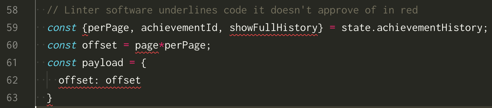

Between you and I, I have never been very good at grammar. I grew up burdened by terrible spelling, atrocious handwriting and a patchy understanding of grammar rules. At school, my heartfelt compositions were met with disdain from grumpy English teachers, who returned them to me covered in red ink. They used to strongly disapprove of my split infinitives and any sentence that a preposition found itself at the end of.

It’s partly why I grew up to be a developer. The reason and logic in the practice of programming were comforting compared to the unfair and arbitrary grammar and spelling rules that I could never remember. But with the passage of time, my hatred of grammar has turned into a fascination.

At [Ocasta](https://ocasta.com), we have incorporated tools into our workflow for automated code linting. Linter software will parse your source code and evaluate it against a set of published guidelines for coding style. If the program feels that parts of your code are breaking these style rules, it will helpfully underline them in red.

Whenever it does this to my code, I find myself uncomfortably reminded of my school work defaced with red ink. It recently occurred to me that this is not just a visual coincidence. I believe that both the grumpy English teachers and the automated linting algorithms are falling into the same trap. That of blindly following prescriptive rules.

What are prescriptive rules? How can we avoid them? And are there better alternatives to help us improve our code?

## Description vs Prescription

Ever since I read ["The language instinct"](https://www.amazon.co.uk/Language-Instinct-Creates-Penguin-Science-ebook/dp/B002RI9DJW/ref=sr_1_1?ie=UTF8&qid=1547309336&sr=8-1&keywords=the+language+instinct) by Stephen Pinker, I have been fascinated by the difference between prescriptive and descriptive grammar. The grammar rules taught in school and policed by copy editors are prescriptive rules. These are rules that prescribe the way that people should speak, and people who don’t follow them are judged to be using the language incorrectly. Here are some examples you may have come across.

- Saying "From whom is that?" instead of "Who is that from?", as you should not end a sentence with a preposition.
- Saying "To go boldly" instead of "To boldly go", as you should not split an infinitive.
- Saying "Rachel and I went shopping" instead of "Rachel and me went shopping".

Prescriptive rules are often arbitrary and illogical, and occasionally can be traced to a single inventor. For example, the rule about "Rachel and I went shopping" was invented by a 16th Century Bishop named [Robert Lowth](https://en.wikipedia.org/wiki/Robert_Lowth), who wanted English to work more like Latin.

For a long time, all grammar was prescriptive, but that changed in the 60’s thanks to the work of the linguist [Noam Chomsky](https://en.wikipedia.org/wiki/Noam_Chomsky). Chomsky’s theory of "Universal Grammar" states that all humans are born with an innate understanding of grammar. When we learn to speak as toddlers, we learn the specifics of the language we are born into. However, the basic building blocks of grammar are hard-wired into our brains.

There is an underlying logic to our grammar that we are born understanding, and by studying and analysing how people speak naturally, linguists can discover patterns and rules. These are descriptive grammar rules, and they differ from prescriptive rules in that they describe how people speak instinctively rather than tell people how to speak.

Here are a few examples.

- Saying "Rachel ate the cheese" instead of "Rachel the cheese ate" ("subject – verb – object" word order)
- Saying "I went to the cinema" instead of "Me went to the cinema" (subjective case personal pronouns)
- Saying "I saw myself in the mirror" instead of "I saw me in the mirror" (reflexive pronouns)

These examples seem trivial to native English speakers, but people learning English as a second language have to put a lot of effort into getting them right. Not all descriptive rules are so obvious. Here is one you’ve probably never seen before:

1. Opinion
1. Size
1. Age
1. Shape
1. Colour
1. Origin
1. Material
1. Purpose

I first heard about this list of words on the excellent "Lexicon Valley" [podcast](https://slate.com/human-interest/2016/10/john-mcwhorter-on-the-made-up-rules-of-pronouns.html), but I think it originates from the work of [Mark Forsyth](https://www.amazon.co.uk/Elements-Eloquence-Perfect-English-Phrase/dp/1848316216). Believe it or not, this list represents the order that native English speakers will put adjectives in front of a noun. It is the reason why the phrase "Green little men" sounds weird compared to "Little green men". According to the rule, we naturally put adjectives of size before adjectives of colour.

## A matter of instinct

The important distinction between prescriptive and descriptive grammar rules is how easy we find them to follow. The descriptive rule about adjective order, for example, has never been taught in school. And yet, despite the rule’s complexity, small children will instinctively say things like "Little green men" or "Old wooden spoon" without anyone instructing them to do so.

Contrast this with the prescriptive rule about "Rachel and I go shopping", which is on the face of it pretty simple. Small children will constantly say "Rachel and me go shopping", despite their teachers and parents telling them it should be "Rachel and I".

Adults also consistently make the same mistake, or the opposite mistake by saying "between you and I" instead of "between you and me". The adults that do so include people with fairly high proficiency in English, such as William Shakespeare!

> "...all debts are cleared between you and I, if I might but see you at my death"
> <cite>Bassanio, Merchant of Venice, Act III – Scene I</cite>

We find the prescriptive rules hard to follow, irrespective of how complex they are, because they are invented, arbitrary, and often go against our intuition. The descriptive rules, on the other hand, are easy to follow because they are instinctive. We learned to follow them as children by listening to, analysing and mimicking speech, armed with an inbuilt concept of the basic building blocks of grammar. We follow them subconsciously, often without even knowing the rules exists.

Unfortunately, this does not mean that we can ignore the prescriptive rules. We have to adhere to both descriptive and prescriptive grammar rules in order to get by in life. If a potential employer rejects your CV because it is full of split infinitives, there is no point trying to persuade them that modern linguistics accepts them.

However, it is useful to be able to recognise prescriptive rules for what they are and constantly question their validity. Descriptive grammar shows us that by studying how people speak, rather than telling them how to speak, we can uncover rules that are powerful and intuitive.

## Readable code

As a developer, one of the many difficult challenges I face is writing code that can be easily understood and maintained. Code that is easy to read is surprisingly hard to write.

Programming languages are flexible and expressive and there are many different ways to tell a computer to perform a single task, only a few of which will be easily understood by humans. Developers write code knowing exactly what it is intended to do, but making it readable requires writing it in such a way that it could be understood without this knowledge.

Even if we overcome these obstacles, development is a collaborative endeavour and there are other people to consider. We all have different styles, levels of experience and ways of learning, and one developer’s beautiful codebase is another developer’s confusing mess.

Add in time pressure and budgetary constraints, and it’s no surprise how often code is hard to read. The stakes are high because the unreadable code is hard to maintain and change. On long-lived projects, you can end up with parts of the codebase that developers are scared to touch and have to try to work around.

For something as important as code readability, there is surprisingly little literature to help. There are a couple of books, a few blog posts and some YouTube videos offering advice, and various code style guides that aim to improve readability by enforcing consistency. However, the amount of material pales in comparison to the documentation for the programming languages we write in.

Prescriptive advice

One thing that all the literature has in common is that it is full of prescriptive rules. Subjective opinions are presented as objective rules or "idioms" without any justification from research or empirical evidence.

Take the example of code comments. These are lines of text that are added to the code to provide information to the reader but have no effect on the running of a program. The use of code comments is controversial. Some people love them, believing that you should give your code as much written context as you can. Tom Hudson has a talk about readable code on [YouTube](https://www.youtube.com/watch?v=OVf0xP4BLq0&feature=youtu.be&t=467) where he says that you should "Practically tell a story with your comments".

Other people hate them, believing that a code comment is an indication that the code it describes is not readable enough. Dmitry Pashkevich, in his code readability talk on [YouTube](https://www.youtube.com/watch?v=8WF4AjM-XW8&feature=youtu.be&t=310), says that "Your ideal should be, our code does not need comments".

Both of these talks are well presented, informative and contain very good advice on making your code more readable. But they also contain two diametrically opposing opinions on code comments, presented as prescriptive rules. Is one of them correct? Is it all just a matter of taste? Is there an objective code readability truth?

## A useful metaphor

Could code readability benefit from its own version of “Universal Grammar”? Chomsky’s theory applies to native speakers of a language, and since there are no native speakers of any programming language (as yet), the metaphor isn’t perfect. However, I do feel that code readability has much to learn from the world of linguistics.

I believe that we should try to replace the prescriptive code readability rules currently available with descriptive ones. These alternative rules would represent patterns in the way that developers instinctively code which directly improve readability. If we could discover these patterns, and develop rules based on them, they would make the challenge of writing readable code much easier.

In a typical professional software team, you have a senior developer leading a number of junior developers, with the senior prescribing a set of coding standards and guidelines for the team. The juniors will spend a lot of effort trying to code to those standards and the senior will spend a lot of effort policing them.

But if the team had access to a set of descriptive readability rules, then the whole team, including the senior, could work to follow these instead. Since these rules would be intuitive by definition, the amount of effort on everyone’s part would be much less.

## How readable?

Descriptive readability rules, if they exist, would make our job as developers a lot easier. However, finding them will be a challenge. In linguistics, descriptive rules are based on empirical observation, either by analysing the corpus of written literature or conducting experiments on native language speakers.

To apply the same methods to software, we would first need to define an objective metric for readability. Currently, code is considered readable if someone believes they found it easy to read. This opinion is entirely subjective and doesn’t necessarily reflect the intrinsic readability of the code.

If we could define an objective definition of readability, and work out a way to measure it, then by studying examples of readable code we could uncover underlying rules. For instance, we could compare code samples that contained comments with samples that did not, and measure their relative readability. If the results were to suggest a correlation between comments and readability, this would then be a candidate for a descriptive rule.

I am excited by the possibility of discovering descriptive readability rules, and last autumn I started an online experiment to try and find some. My experiment on [howreadable.com](http://www.howreadable.com/)  compared various coding patterns against each other in an attempt to objectively measure their readability. I haven’t found any strong candidates for descriptive rules so far, but the results are promising and suggest a potential way forward.

I [presented](https://www.youtube.com/watch?v=dlczTNFHpww) my initial findings at the [Brighton Async](https://asyncjs.com/readable-code/) meet-up last December and hope to perform a second iteration of the experiment this year. I am confident that if we spend less time trying to tell developers how to code, and more time trying to learn from how they code instinctively, we can find descriptive rules and make it much easier to write readable and maintainable code.

In the meantime, I intend to follow the guidelines that feel sensible and fight against the ones that feel arbitrary. I will try to remember that just because I find my code easy to read, it doesn’t mean that others will. And if my automated code linter plugin insists on defacing my beautiful work with its horrid red underlines, I can always put in my earbuds, turn on my favourite linguistics podcast, and cheer myself up with some descriptive grammar.
